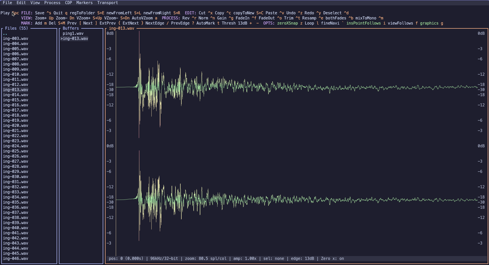
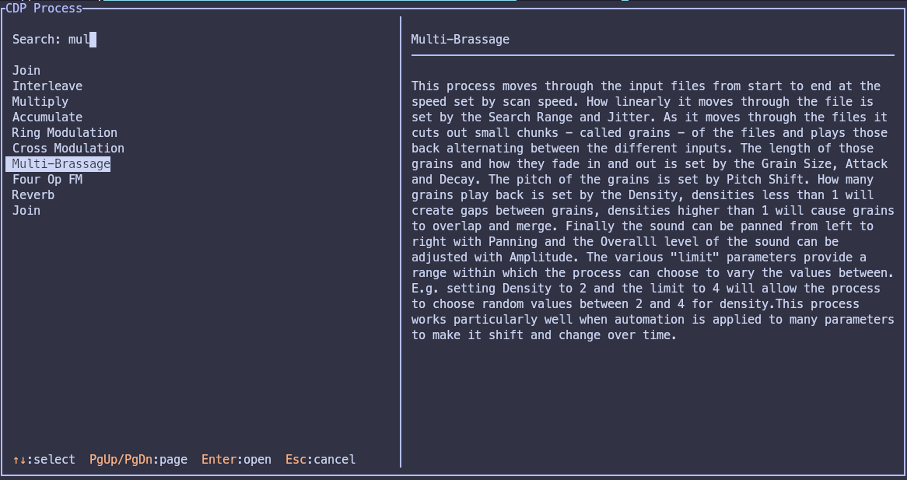
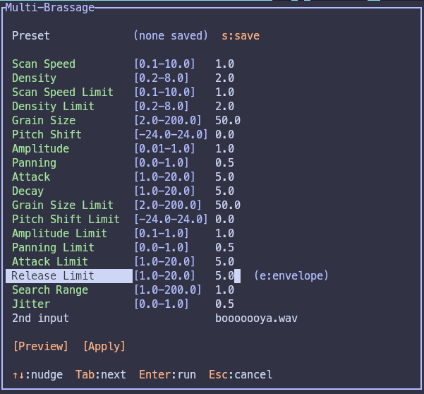
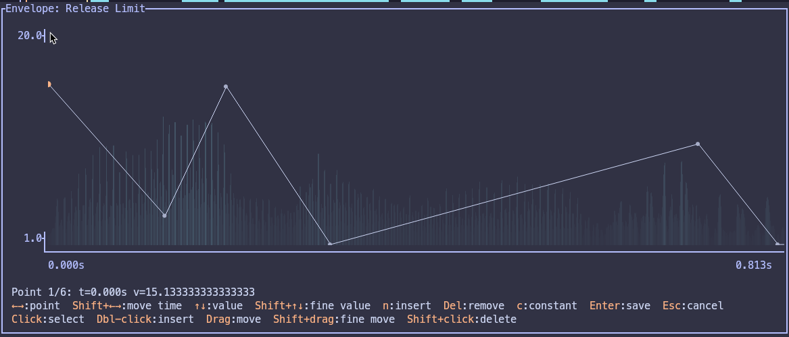

# tui-wave



A keyboard-driven **terminal audio editor** for Linux, macOS, and Windows, written in Rust (mouse works too). It opens WAV files and gives you a zoomable waveform you can navigate,
play, and edit entirely from the keyboard: selection, cut/copy/paste, undo/redo, normalize, gain, fades, reverse, trim, resample, mix-to-mono, and timeline markers with transient
detection — plus a menu bar, a context-aware toolbar, fully configurable keyboard shortcuts via .toml config file, a file browser, and multi-buffer editing. Edits are saved back to WAV at 16-bit, 24-bit, or 32-bit float, and BWF cue points / markers are preserved across the round trip. A dedicated command chops a file at its markers and exports each region as a separate WAV.

Optionally, tui-wave is also a front-end to the **[Composer's Desktop Project](https://www.composersdesktop.com)** (CDP) — a large, decades-old suite of external command-line
sound-transformation tools (spectral blurring, granulation, morphing, time-stretching, and much more). Browse the catalog, edit parameters (with breakpoint-envelope automation and
a graphical curve editor), preview through your speakers, and apply with full undo — see [Optional: CDP support](#optional-cdp-composers-desktop-project-support) below. CDP is not
bundled; it's free, separately-distributed software you install or build yourself.

Press `F10` (or `Alt`+a menu letter) to open the menus, `Tab` / `Shift+Tab` to move focus
between the waveform, the file list, and the open buffers, and `q` to quit.

See [USERGUIDE.md](USERGUIDE.md) for the full keybinding reference and workflow tips.

CDP process browser, parameter form with automatable (green) fields and presets, and the
breakpoint envelope editor:

<p>
  
  
  
</p>

## Status and Disclaimer
This is developed with the assistance of LLM. I am not a Rust developer, however I have certain expertise in working with audio files. I needed this instrument for my own work.
I am providing release builds for Linux but please build with cargo for the most feature-complete executables (see below).

## Prerequisites

- **Rust toolchain** (the `cargo` build tool), version **1.85 or newer** — the project uses
  the 2024 edition. Install it from <https://rustup.rs>:

  ```sh
  curl --proto '=https' --tlsv1.2 -sSf https://sh.rustup.rs | sh
  ```

  (On Windows, download and run `rustup-init.exe` from the same site instead.)

- **An audio output device** is optional — without one you can still view and edit
  waveforms, you just won't hear playback.

### Platform-specific build dependencies

- **Linux:** the audio backend needs the ALSA development headers.
  - Debian/Ubuntu: `sudo apt install libasound2-dev pkg-config`
  - Fedora: `sudo dnf install alsa-lib-devel pkg-config`
  - Arch: `sudo pacman -S alsa-lib pkgconf`
- **macOS:** nothing extra — uses the system CoreAudio framework.
- **Windows:** nothing extra — uses the system WASAPI backend.

## Install, compile, and run

Clone the repository and build with Cargo. The commands are the same on all three
platforms (use PowerShell or Windows Terminal on Windows).

```sh
git clone <repository-url> tui-wave
cd tui-wave

# Build an optimized binary (recommended — debug builds are noticeably slower on
# large files because of the one-time waveform-cache build).
cargo build --release

# Run the compiled binary directly:
#   Linux/macOS:
./target/release/tui-wave path/to/audio.wav
#   Windows:
#   .\target\release\tui-wave.exe path\to\audio.wav
```

Running with no file argument opens an empty editor — focus the file panel with `Tab`,
browse, and press `Enter` on a `.wav` to open it. You can also point it at a directory
(`tui-wave path/to/folder`) to start browsing there.

To install it onto your `PATH` so you can call `tui-wave` from anywhere:

```sh
cargo install --path .
```

## Optional: CDP (Composer's Desktop Project) support

tui-wave includes a dialog-driven front-end (`Ctrl+P`, or **Process → CDP Process…**) to
[CDP](https://www.composersdesktop.com), a large suite of external, offline sound-transformation
programs — spectral blurring, granulation, morphing, waveset distortion, time-stretching, and
hundreds more. This is entirely optional: tui-wave works fully without it, and the feature simply
stays unavailable (a first-use prompt explains why) until you configure a CDP directory.

**About CDP.** Composer's Desktop Project was founded in 1986 in Yorkshire, UK by composers
Andrew Bentley, Archer Endrich, Richard Orton, and Trevor Wishart, aiming to bring the kind of
sound-transformation power previously found only on institutional mainframes to a personal
"desktop." It's been free, open-source software since 2014, licensed under the
[GNU LGPL 2.1+](https://github.com/ComposersDesktop/CDP8/blob/main/LICENSE), and is still
actively developed (CDP8, released 2023, added roughly 80 new processes over the prior CDP7).
tui-wave's built-in catalog of ~120 processes (parameter names, ranges, and descriptions) is
adapted from [SoundThread](https://github.com/j-p-higgins/SoundThread) by Jonathan Higgins (MIT
license) — see [`THIRD_PARTY_NOTICES.md`](THIRD_PARTY_NOTICES.md) for the full text. All credit
for CDP itself, and for the ~250 underlying command-line programs tui-wave shells out to, belongs
to the Composer's Desktop Project — tui-wave neither bundles nor redistributes any CDP binaries.

**Installing CDP.** CDP is not on `PATH` by default, and there's no package-manager install for
it — download or build it yourself, then tell tui-wave where the binaries live:

- **Windows / macOS** — download a prebuilt release from
  <https://www.unstablesound.net/cdp.html> (CDP's official download mirror) and unzip/mount it
  anywhere; the binaries end up in a folder such as `_cdprogs` or `NewRelease`.
- **Linux** (no prebuilt binaries are offered) — clone and build from source:

  ```sh
  git clone https://github.com/ComposersDesktop/CDP8.git
  cd CDP8
  mkdir build && cd build
  cmake ..
  make
  ```

  This needs `cmake` and a C compiler (`gcc`/`clang`) on `PATH`; see the repo's own
  [`building.txt`](https://github.com/ComposersDesktop/CDP8/blob/main/building.txt) for
  platform notes (Windows/macOS instructions are there too, if you'd rather build than use the
  prebuilt download). The compiled binaries land in a top-level `NewRelease/` directory once
  the build finishes.
- The older [CDP7](https://github.com/ComposersDesktop/CDP7) source builds the same way and is
  also compatible — tui-wave's process catalog doesn't depend on a specific CDP release.

Then, in tui-wave, open the CDP dialog (`Ctrl+P`) — on first use it prompts for the directory
containing the binaries; you can revisit it later via **Options → Configure CDP Directory…**.
The path is saved to `cdp_dir` in your `config.toml`. See
[USERGUIDE.md](USERGUIDE.md#cdp-processes) for the full workflow: browsing, editing parameters,
breakpoint automation, presets, preview/apply, and adding your own process definitions.

## Development

```sh
cargo build      # debug build
cargo test       # run the test suite
```

A reasonably large terminal is recommended (≈120×40 or more) so the file and buffer side
panels and the dB gutters all fit.

## Packaging

Build scripts under `packaging/` produce distributable Linux packages into `dist/`. All
of them share the same `Terminal=true` desktop entry (it's a terminal app) and 512×512
icon, and are named with the version and target architecture.

```sh
./packaging/build-appimage.sh   # -> dist/tui-wave-<ver>-<arch>.AppImage      (distro-agnostic)
./packaging/build-pkg.sh        # -> dist/tui-wave-<ver>-1-<arch>.pkg.tar.zst (Arch: pacman -U)
./packaging/build-deb.sh        # -> dist/tui-wave_<ver>_amd64.deb            (Debian/Ubuntu)
```

- **AppImage** — built with [`cargo-appimage`](https://crates.io/crates/cargo-appimage)
  (`appimagetool` on `PATH`); bundles `libasound.so.2` so audio works without a system ALSA.
- **Arch** — `makepkg` packaging the release binary; depends on `gcc-libs` and `alsa-lib`.
- **Debian** — assembled with `ar`/`tar` (no `dpkg-deb` needed); depends on `libc6`,
  `libgcc-s1`, `libasound2`.

The native packages link against the build machine's glibc; for a `.deb`/`.pkg` that runs
on older targets, build inside a matching container.
