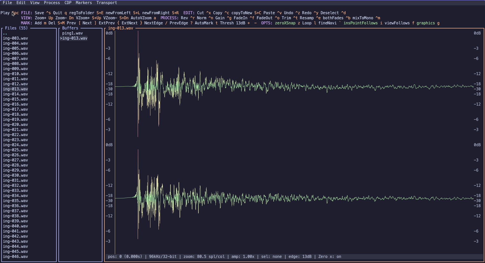
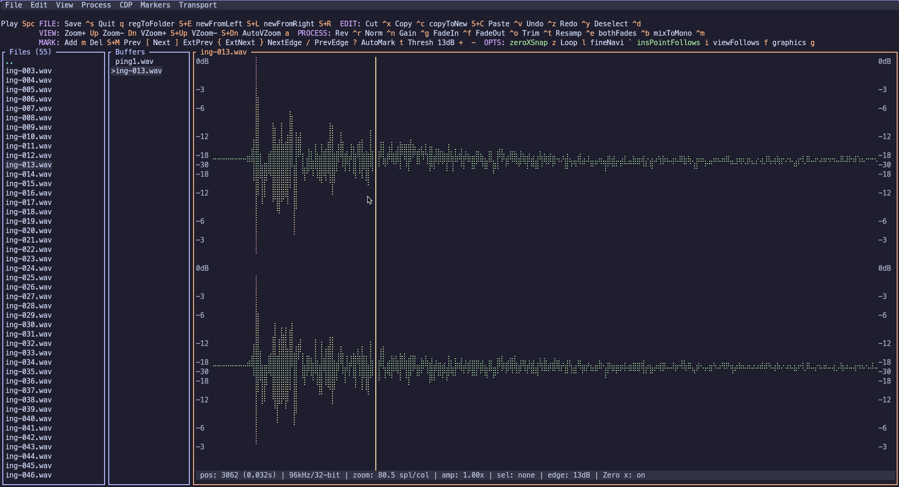
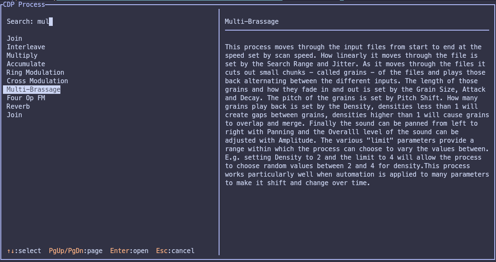
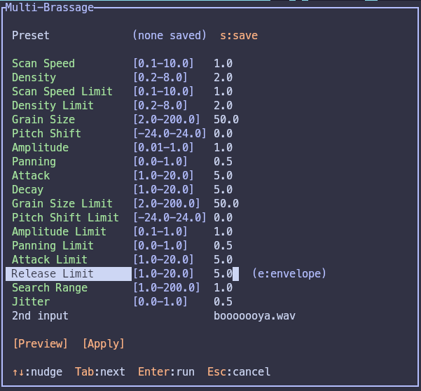
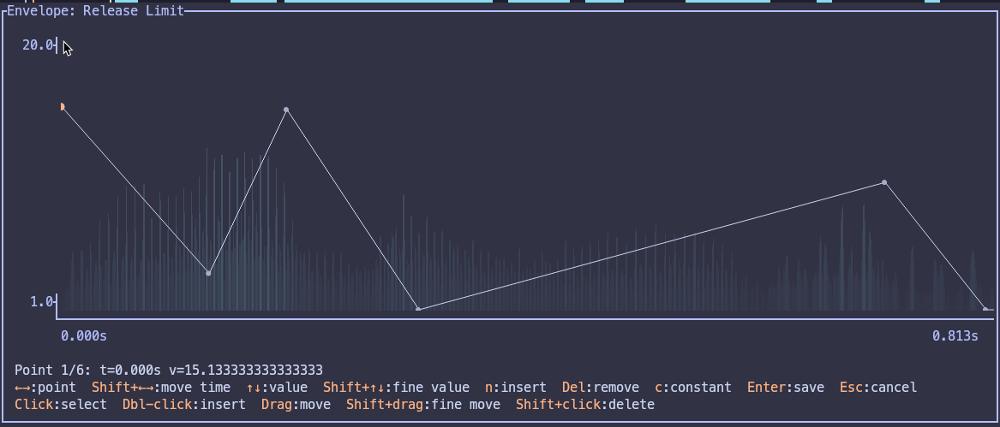

# tui-wave

A keyboard-driven audio editor that runs in a terminal (mouse works too!).




tui-wave draws waveforms, plays and edits audio. It handles mono, stereo and multichannel
files. Multichannel files that exceed the configurable threshold in size (default: 4GB) open in 
streaming mode without loading into memory. This is needed for processing / auditioning / breaking 
large session captures made with software like Cycling74's Max, etc.
tui-wave is also, optionally, a front end for Composer's Desktop Project, a set of command-line
utilities that exist for decades and provide a lot of unique time and frequency domain 
processing capabilities.

Read [DOCUMENTATION.md](DOCUMENTATION.md) to learn how to use it.

## What it does

- **Waveform display.** Zoom from the whole file down to single samples. Terminals such as
  kitty and ghostty get graphics. Every other terminal gets approximation via braille glyphs.
- **Playback.** Play, pause, and loop. The view can follow the play position.
- **Editing.** Cut, copy, paste, delete, and undo, with a separate undo stack per open file.
- **Processing.** Reverse, normalize, gain, fade, trim, resample, and mix to mono.
- **Markers.** Insert markers by hand or at transients. tui-wave saves them as WAV cue points,
  which Audacity and Sound Forge read.
- **Many channels.** Scroll through the channels of a multichannel file. Drop the empty ones.
  Split the rest into mono files or stereo pairs.
- **Large files.** A file above the memory limit opens read-only and disk-backed. tui-wave
  reads and writes RF64 and BW64.
- **Formats.** It reads WAV, FLAC, and AIFF. It writes WAV, FLAC, and MP3.
- **Configurable.** Every key assignment lives in a TOML config file.
- **CDP.** An optional front end to the Composer's Desktop Project, with a growing list 
(hundreds) of processes implemented.
- **Praat.** An optional front end to praatAudioTools, 352 sound-transformation scripts for
Praat, in the same browser and chainable with CDP.

The CDP process browser, the parameter form with automatable green fields and presets, and the
breakpoint envelope editor:

<p>
  
  
  
</p>

## Status

An LLM helped to write this program. I am not a Rust developer. I have a lot of experience 
with digital audio, and I put a lot of effort into tui-wave's architecture, logic and UX / UI.
I needed this tool for my own work.

## Prerequisites

**The quick way.** `./install.sh` does everything below on macOS and Linux — toolchain, build
dependencies, Praat, the script submodule, the optional Python environment, then builds and
installs. It asks before anything needing `sudo`, `--dry-run` shows exactly what it would run,
and it never touches your system Python. It deliberately does not install CDP: those binaries
are a separate licensed download (see below).

Everything after this section is what that script automates, for anyone who would rather do it
by hand or is on Windows.

You need the Rust toolchain, version 1.85 or newer. The project uses the 2024 edition. Install
it from <https://rustup.rs>:

```sh
curl --proto '=https' --tlsv1.2 -sSf https://sh.rustup.rs | sh
```

On Windows, download and run `rustup-init.exe` from the same site.

An audio output device is optional. Without one you can still view and edit waveforms. You just
hear nothing.

### Build dependencies per platform

- **Linux.** The audio backend needs the ALSA development headers.
  - Debian and Ubuntu: `sudo apt install libasound2-dev pkg-config`
  - Fedora: `sudo dnf install alsa-lib-devel pkg-config`
  - Arch: `sudo pacman -S alsa-lib pkgconf`
- **macOS.** Nothing extra. The program uses the system CoreAudio framework.
- **Windows.** Nothing extra. The program uses the system WASAPI backend.

## Build and run

**On macOS and Linux, `./install.sh` does all of this for you** — it clones nothing (run it from
the repository) but handles the toolchain, the build dependencies, the submodule and the release
build, then installs the binary. The rest of this section is the manual equivalent, and what
Windows needs.

Clone the repository, then build with Cargo. The commands work the same on all three platforms.
On Windows, use PowerShell or Windows Terminal.

```sh
git clone <this repository>
cd tui-wave
cargo build --release
```

Always build with `--release`. A debug build draws long files many times slower, because
tui-wave builds a waveform summary once per file.

Run the binary directly:

```sh
./target/release/tui-wave path/to/audio.wav
```

On Windows the path reads `.\target\release\tui-wave.exe`.

The argument is optional: pass a file to open it, a directory to start the Files panel there,
or nothing for an empty screen. `--version` (`-V`) and `--help` (`-h`) print and exit without
starting the editor.

Use a terminal window of about 120 by 40 characters or larger. That leaves room for the side
panels and the decibel gutters.

## First steps

1. Start the program with an audio file, or with a directory to browse.
2. Press `Tab` to move focus between the Waveform, Files, and Buffers panels.
3. Press the Up and Down arrows to zoom. Press Left and Right to move the cursor.
4. Hold `Shift` and press Left or Right to select audio.
5. Press `Space` to play.
6. Press `F10` to open the menu bar.
7. Press `q` to quit.

[DOCUMENTATION.md](DOCUMENTATION.md) covers the rest.

## Optional: CDP support

CDP is the Composer's Desktop Project, a large set of offline sound transformation programs.
It covers spectral blurring, granulation, morphing, waveset distortion, time stretching, and
hundreds more. tui-wave gives you a dialog-driven front end to it, at `Ctrl+p` or through the
CDP menu. Browse the catalog, edit parameters, draw breakpoint curves, preview through your
speakers, and apply with full undo.

CDP stays optional. tui-wave works fully without it. The feature waits until you point it at a
CDP directory, and a first-use prompt explains why.

tui-wave looks in `~/cdp` by default. Unpack or build CDP there and the program finds it with no
setup. Anywhere else, answer the prompt with the real path. You can change the path later
through CDP+Praat then Configure CDP Directory. tui-wave saves it as `cdp_dir` in your config
file.

### About CDP

Four composers founded the Composer's Desktop Project in 1986 in Yorkshire, UK: Andrew Bentley,
Archer Endrich, Richard Orton, and Trevor Wishart. They wanted to bring sound transformation
power from institutional mainframes to a personal desktop.

CDP has been free and open-source software since 2014, under the
[GNU LGPL 2.1+](https://github.com/ComposersDesktop/CDP8/blob/main/LICENSE). Work on it
continues. CDP8, from 2023, added about 80 processes over CDP7.

All credit for CDP, and for the roughly 250 command-line programs tui-wave calls, belongs to the
Composer's Desktop Project. tui-wave neither bundles nor redistributes any CDP binary.

The process catalog in tui-wave mostly adapts parameter names, ranges, and descriptions from
[SoundThread](https://github.com/j-p-higgins/SoundThread) by Jonathan Higgins, under the MIT
license. See [THIRD_PARTY_NOTICES.md](THIRD_PARTY_NOTICES.md) for the full text. A growing set
of hand-written entries covers CDP programs that SoundThread never reached.

### Installing CDP

CDP does not go on your `PATH`, and no package manager carries it. Download it or build it
yourself, then tell tui-wave where the binaries live.

- **Windows and macOS.** Download a prebuilt release from
  <https://www.unstablesound.net/cdp.html>, the official CDP download mirror. Unzip or mount it
  anywhere. The binaries land in a folder such as `_cdprogs` or `NewRelease`.
- **Linux.** CDP offers no prebuilt Linux binaries. Build from source:

  ```sh
  git clone https://github.com/ComposersDesktop/CDP8.git
  cd CDP8
  mkdir build && cd build
  cmake ..
  make
  ```

  This needs `cmake` and a C compiler on your `PATH`. The CDP repository holds its own
  [building.txt](https://github.com/ComposersDesktop/CDP8/blob/main/building.txt) with notes per
  platform. The compiled binaries land in a top-level `NewRelease` directory.

The older [CDP7](https://github.com/ComposersDesktop/CDP7) source builds the same way and works
just as well. The tui-wave catalog does not depend on one CDP release.

## Optional: Praat support

praatAudioTools is a collection of sound-transformation scripts for Praat, by Shai Cohen of
Bar-Ilan University. tui-wave runs 434 of them: granular, spectral, reverb, distortion, spatial,
generative and more. They share the `Ctrl+p` browser with CDP, under a **Praat** domain, and a
chain (`Ctrl+h`) can mix the two freely.

Praat support is optional in the same way CDP support is: tui-wave works fully without it.

**`./install.sh` sets up both of the things below** — the Praat binary and the script submodule —
so if you ran it there is nothing here left to do. What follows is the manual route.

You need two things.

**Praat**, from your package manager:

```sh
sudo pacman -S praat          # Arch
sudo apt install praat        # Debian, Ubuntu
brew install --cask praat     # macOS
```

tui-wave finds it on your `PATH`, so there is usually nothing to configure. Set `praat_bin` in
your config file if yours lives elsewhere — on macOS the executable sits inside the app bundle,
at `/Applications/Praat.app/Contents/MacOS/Praat`.

**The scripts**, which ship with tui-wave as a git submodule. Clone with them:

```sh
git clone --recursive https://github.com/biomassa/tui-wave
```

Or fetch them into an existing clone:

```sh
git submodule update --init
```

If you forget, tui-wave says exactly that when you run a Praat process. Point
`praat_audiotools_dir` at your own checkout if you would rather use one.

Nothing is installed into your Praat setup, and your Praat preferences folder is never written
to.

### Optional: the `py` process group

**`./install.sh` offers to set this up for you**, into a virtual environment it owns — the rest of
this section is the manual route.

34 of those scripts do their work in Python rather than in Praat: they hand the audio to a
helper script and read the result back. They appear under their own **py** group in the browser,
so the extra requirement is visible before you pick one rather than a surprise when you run it.
Everything in the other thirteen groups works without any of this.

They need three Python packages, and two more for the interactive ones:

| Package | Needed for |
|---|---|
| `numpy`, `scipy`, `soundfile` | all 34 — the array maths and WAV I/O every helper uses |
| `sounddevice` | Arranger and Performance Launcher, which audition while you work |
| `pillow` | Spectral Eraser, which paints on a spectrogram image |

`./install.sh` asks whether to install them and puts them in a virtual environment tui-wave
owns, at `~/.config/tui-wave/praat/pyenv`. **Your system Python is never modified** — which
matters on Arch and recent Debian, where it is marked externally-managed and `pip install`
refuses outright.

tui-wave runs these scripts against that venv's interpreter directly, so it does not matter
which Pythons your machine has or how Praat was launched. This is what makes the `py` group
work on macOS: the scripts pick their own interpreter and on a Mac pick an *absolute* path
(`/opt/homebrew/bin/python3` and friends), which no `PATH` setting can influence — so before
this they quietly used a Python that had none of these packages.

To do it by hand:

```sh
python3 -m venv ~/.config/tui-wave/praat/pyenv
~/.config/tui-wave/praat/pyenv/bin/pip install numpy scipy soundfile sounddevice pillow
```

tui-wave puts that environment ahead of your `PATH` for the Praat process it starts, so the
scripts find it without any of them being edited. If the environment does not exist, `PATH` is
left alone and the scripts use whatever `python3` you already have — so if those packages are
already installed system-wide, nothing more is needed.

Four of these open a window of their own — a spatial trajectory painter, a step arranger, a
performance launcher, a spectrogram eraser. They run with no time limit, since you are the one
deciding when they are finished; `Esc` cancels.

## Development

```sh
cargo build      # debug build
cargo test       # run the test suite
```

`CHANGELOG.md` records what changed in each version. `MANUAL_TESTING.md` holds the checklist for
the parts that no test can cover, such as real audio hardware and real terminal quirks.
